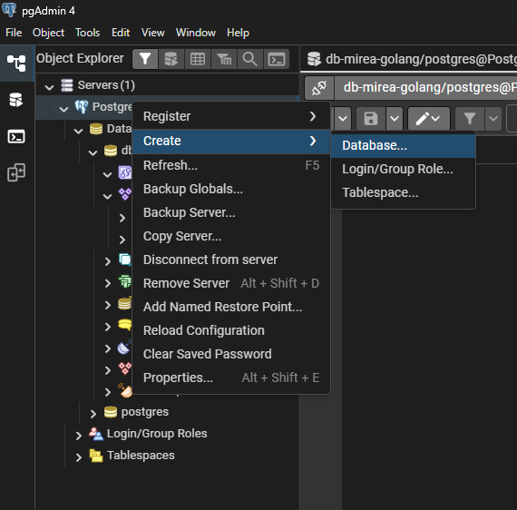

## Первичная настройка проекта

Все эти шаги нужно сделать только ОДИН РАЗ.

- Настраиваем бекенд
  - Устанавливаем Golang v1.24.9
  - Устанавливаем PostgreSQL v18
  - Открываем pgadmin4.exe
  - Задаем пароль (любой, запомни его)
  - Создаем новую базу данных, название любое (на латинице и без пробелов)
    
  - Открываем в VSCode консоль (`ctrl` + `~`, или Вид->Терминал)
  - Вводим в консоль `setup.sh`
  - В файле `.env` меняем пароль и название базы данных на введенные ранее
- Настраиваем фронтенд
  - Скачиваем NodeJS по ссылке (https://nodejs.org/en/download), устанавливаем его
  - Открываем cmd и поочередно вставляем и выполняем эти команды:

```pwsh
node -v # Должно напечатать "v22.20.0".
corepack enable pnpm
pnpm -v # Должно напечатать "10.9.3".
```

- Вводим в консоль `go run cmd/main.go`
- Ура, все работает!

## Запуск

Проект запускается в консоль через команду:

```bash
go run cmd/main.go
```
